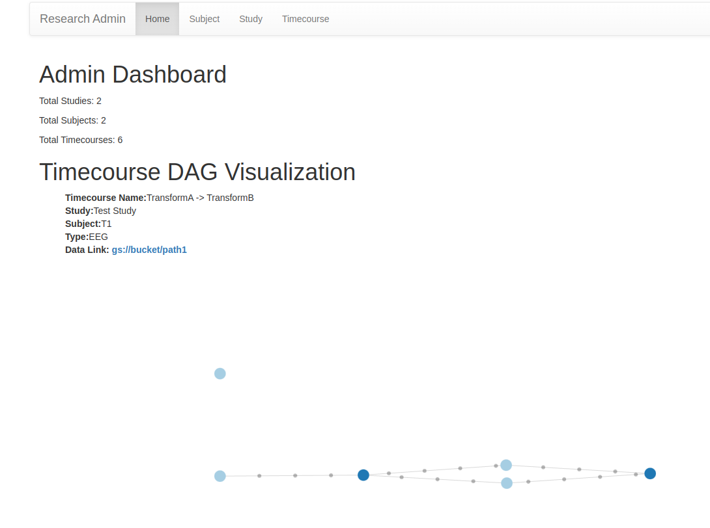

# ExpDB: Neuroimaging Experiment Database


A robust database and data lineage system designed specifically for neuroimaging experiments. ExpDB provides comprehensive tracking of experimental data, subject information, and data transformations with built-in version control integration.

## Features

- **Experiment Tracking**: Manage studies, subjects, and their associated data
- **Data Lineage**: Track data transformations and maintain complete history of data processing
- **Storage Management**: Flexible storage backend supporting both local and Google Cloud Storage
- **Web Interface**: Administrative dashboard for data visualization and management
- **Type Safety**: Full type checking with modern Python type hints
- **Schema**: High level Python API using SQLAlchemy
- **Version Control Integration**: Automatic git commit tracking for data transformations

## Installation

1. Clone the repository:

```bash
git clone https://github.com/cmcneil/expdb.git
cd expdb
```

2. Create a virtual environment and install dependencies using uv:

```bash
uv venv
source .venv/bin/activate  # On Windows: .venv\Scripts\activate
uv pip install -e .
```

3. Set up environment variables:

```bash
export FLASK_ENV=development  # or 'production'
export DB_USER=expdb
export DB_PASSWORD=your_password
export DB_HOST=your_host
export DB_NAME=expdb
export GS_BUCKET_NAME=your_bucket  # for Google Cloud Storage
```

## Database Configuration

ExpDB supports both PostgreSQL (production) and SQLite (development):

### PostgreSQL Connection

Check connection to PostgreSQL:

`psql -h expdb.c.carsonmcneil.internal -U expdb -d expdb -W`

### Development Setup
For local development, SQLite will be used automatically when `FLASK_ENV=development`. A small test database will be loaded automatically.

## Usage

### Starting the Application

```bash
python app.py
```

### Basic Data Model

- **Study**: Research study containing multiple subjects and timecourses
- **Subject**: Research participant with associated metadata
- **Timecourse**: Time-series data with associated metadata
  - Supports multiple modalities (EEG, fMRI, behavioral data)
  - Tracks data transformations and processing steps
  - Maintains data lineage through DAG structure

### Example: Creating a Study

```python
from expdb.db import Session
from expdb.models import Study, Subject
session = Session()
study = Study(
    name="meditation_study_2024",
    description="Effects of meditation on attention",
    github_repo="github.com/lab/meditation-study"
)
session.add(study)
session.commit()
```

### Example: Adding a Subject

```python
subject = Subject(
    code="JD",
    name="John Doe",
    age=25,
    meditation_experience=3
)
study.subjects.append(subject)
session.add(study)
session.commit()
```

## Transforms

ExpDB provides a Transform system for tracking data transformations and maintaining data lineage. Transforms allow you to:

- Apply processing steps to timecourse data
- Automatically track data lineage in a DAG structure
- Record git commits for reproducibility
- Store transform parameters and metadata

### Example: Creating a Custom Transform

```python
from expdb.transforms import Transform
from expdb.models import Data, DataType, Modality

class FilterTransform(Transform):
    input_datatype = Data(
        sampling_rate=256.0,
        modality=Modality.IMAGING,
        type=DataType.EEG
    )
    output_datatype = input_datatype

    def transform(self, data):
        # Apply filtering
        filtered_data = apply_filter(data, **self.params)
        return filtered_data

# Apply the transform
transform = FilterTransform(
    timecourse=eeg_timecourse,
    cutoff_freq=30,
    filter_type='lowpass'
)
transform.apply_transform()
transform.commit()
```

### Transform Features

- **Automatic Git Integration**: Transforms record the git commit hash when applied
- **Parameter Tracking**: All transform parameters are stored in the database
- **Data Lineage**: Tracks relationships between input and output timecourses
- **Type Safety**: Input/output datatypes are validated
- **Storage Backend Integration**: Automatically handles data storage/retrieval

### Raw Data Upload

For importing new data:

```python
from expdb.transforms import RawDataUpload

upload = RawDataUpload(
    data_type=Data(
        sampling_rate=256.0,
        modality=Modality.IMAGING,
        type=DataType.EEG
    ),
    subject=subject,
    study=study,
    is_pilot=False,
    file_path="path/to/data.eeg"
)
upload.apply_transform()
upload.commit()
```

## Storage Management

ExpDB supports multiple storage backends:

- **Local Storage**: For development and testing
- **Google Cloud Storage**: For production deployment

```python
from expdb.storage import GCSStorageManager
```

### Initialize GCS storage

```python
storage = GCSStorageManager(
    gcs_bucket="gs://expdb-dev",
    local_cache_dir="expdb_cache"
)
```

## Administrative Interface




Access the web-based admin interface at `http://localhost:5000/admin` to:
- View and manage studies
- Track subject information
- Visualize data lineage
- Monitor data transformations

## Development

### Type Checking

### Running Tests

```bash
pytest tests/
```

## Contributing

1. Fork the repository
2. Create a feature branch
3. Commit your changes
4. Push to the branch
5. Create a Pull Request

## License

[Add your license information here]

## Status


